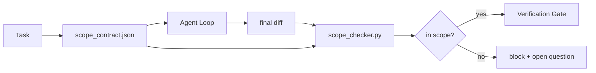

# Scope Contracts and Task Boundaries

> The model does not know where the work ends. A scope contract is a per-task file that says where the work begins, where it ends, and how to roll back if it spills. The contract turns "stay in scope" from a wish into a check.

**Type:** Build
**Languages:** Python (stdlib)
**Prerequisites:** Phase 14 · 32 (Minimal Workbench), Phase 14 · 33 (Rules as Constraints)
**Time:** ~50 minutes

## Learning Objectives

- Write a scope contract that an agent reads at task start and a verifier reads at task end.
- Specify allowed files, forbidden files, acceptance criteria, rollback plan, and approval boundaries.
- Implement a scope checker that compares a diff against the contract and flags violations.
- Make scope creep visible, automatic, and reviewable.

## The Problem

Agents creep. The task is "fix the login bug." The diff touches the login route, the email helper, the database driver, the README, and the release script. Each touch had a plausible reason in the moment. Together they are a different change than the one that was reviewed.

Scope creep is the most under-monitored failure mode in agent work because the agent narrates each step in good faith. The fix is not a stricter prompt. The fix is a contract on disk that says what was promised and a check that compares the result against the promise.

## The Concept



### What goes in a scope contract

| Field | Purpose |
|-------|---------|
| `task_id` | Links to the task on the board |
| `goal` | One sentence the reviewer can verify |
| `allowed_files` | Globs the agent may write |
| `forbidden_files` | Globs the agent must not touch even by accident |
| `acceptance_criteria` | Test commands or assertion lines that prove done |
| `rollback_plan` | One paragraph the operator can execute if a halt is required |
| `approvals_required` | Actions outside scope that need explicit human sign-off |

A contract without `forbidden_files` is incomplete. The negative space is half the contract.

### Globs, not raw paths

Real repos move files. Pin contracts to globs (`app/**/*.py`, `tests/test_signup*.py`) so a refactor between sessions does not invalidate the contract.

### Rollback is part of scope

Listing how to roll back forces the contract author to think about what could go wrong. A contract you cannot roll back from is a contract that should not be approved.

### Scope check is a diff check

The agent writes a diff. The checker reads the diff, the allowed globs, the forbidden globs, and a list of any acceptance commands that ran. Each violation is a tagged finding the verification gate can refuse.

### Two altitudes of scope: the feature list and the task contract

The scope contract bounds one task. It does not bound the project. An agent can stay perfectly inside a contract for the login fix and still, on the next turn, decide the project also needs a settings page, a dark mode toggle, and a rewrite of the router. The contract was never asked which work was in scope for the project, only which files were in scope for the task.

That second altitude needs its own primitive: a `feature_list.json` the agent reads at session start. It is the project backlog as a machine-readable, ordered file. The agent picks exactly one feature whose `status` is `todo`, writes its `id` into the active scope contract, and is forbidden from starting a second feature in the same session. "One feature at a time" stops being a line in the prompt the agent can rationalize past and becomes a value it reads off disk and a check the gate enforces.

```json
{
  "project": "knowledge-base",
  "active": "import-pdf",
  "features": [
    { "id": "import-pdf",   "status": "in_progress", "goal": "import a PDF into the library",        "done_when": "pytest tests/test_import.py && a sample PDF appears in the library view" },
    { "id": "full-text-search", "status": "todo",     "goal": "search document text and rank hits",   "done_when": "query returns ranked results with snippets" },
    { "id": "cite-answers", "status": "todo",         "goal": "answers carry source citations",        "done_when": "every answer renders at least one clickable citation" }
  ]
}
```

| Field | Purpose |
|-------|---------|
| `active` | The single feature the current session may touch; empty means pick one and set it |
| `features[].id` | Stable slug the scope contract's `task_id` points at |
| `features[].status` | `todo`, `in_progress`, `done`, `blocked`; only one `in_progress` at a time |
| `features[].goal` | One sentence the reviewer can verify |
| `features[].done_when` | The acceptance line that flips `in_progress` to `done` |

Two rules make the list load-bearing instead of decorative. First, the invariant "at most one `in_progress`" is itself a startup check (Phase 14 · 33): if the list shows two, the session refuses to start until a human resolves it. Second, the feature list is a file, not a chat message, because the chat scrolls out of context and the file persists across sessions and across agents. The handoff (Phase 14 · 40) writes the finished feature's status back to `done` so the next session opens to an accurate board instead of re-deriving what is left.

The contract and the list compose by least privilege, the same merge described below: the task contract's `allowed_files` must sit inside whatever the active feature touches, never outside it.

## Build It

`code/main.py` implements:

- `scope_contract.json` schema (subset of JSON Schema, glob arrays).
- A diff parser that turns a list of touched files plus a list of run commands into a `RunSummary`.
- A `scope_check` that returns `(violations, in_scope, off_scope)` against the contract.
- Two demo runs: one that stays in scope, one that creeps. The checker flags the creep with the exact file and reason.

Run it:

```
python3 code/main.py
```

Output: the contract, the two runs, the per-run verdicts, and a saved `scope_report.json`.

## Production patterns in the wild

A practitioner running "specsmaxxing" (scope contracts in YAML before invoking the agent) reports rabbit-hole rate dropped from 52% to 21% in three weeks without changing the agent. The contract did the work, not the model. Three patterns make the gain stick.

**Violation budgets, not binary failures.** `agent-guardrails` (the OSS merge gate used by Claude Code, Cursor, Windsurf, Codex via MCP) ships a `violationBudget` per task: minor scope slips within budget are surfaced as warnings; only when the budget is exceeded does the merge gate refuse. Pair with `violationSeverity: "error" | "warning"`. The budget is the difference between a gate that ships and a gate that gets disabled by the team that hated it.

**Severity asymmetry by path family.** Off-scope writes to `docs/**` are usually `warn`; off-scope writes to `scripts/**`, `migrations/**`, `config/prod/**` are always `block`. This asymmetry has to live in the contract, not in the runtime, because it is project-specific and changes per task.

**Time and network budgets next to file budgets.** A `time_budget_minutes` field bounds the wall clock; the runtime refuses to continue past it without re-approval. A `network_egress` allowlist on hostnames prevents the agent from quietly hitting an external API that was not part of the task. These are scope dimensions too; the file globs are necessary, not sufficient.

**Multi-contract merge semantics (least privilege).** When two scope contracts apply (e.g., a project-wide contract plus a task-specific one), the merge is: **intersect** `allowed_files` (both contracts must permit the path), **union** `forbidden_files` (either can prohibit), `time_budget_minutes` is the most restrictive (min), `approvals_required` accumulates. `network_egress` is `None` for no enforcement, `[]` for deny-all, `[...]` as an allowlist; under merge, `None` defers to the other side, two lists intersect, and deny-all stays deny-all. State this in the contract schema so the merge is mechanical and reviewable.

## Use It

Production patterns:

- **Claude Code slash commands.** A `/scope` command writes the contract and pins it as session context. Subagents read the contract before acting.
- **GitHub PRs.** Push the contract as a JSON file in the PR body or as a checked-in artifact. CI runs the scope checker against the merge diff.
- **LangGraph interrupts.** A scope violation triggers an interrupt; the handler asks the human whether the contract needs to grow or the agent needs to back off.

The contract travels with the task. When the task closes, the contract is archived under `outputs/scope/closed/`.

## Ship It

`outputs/skill-scope-contract.md` generates a scope contract for a task description and a glob-aware checker that runs in CI on every agent diff.

## Exercises

1. Add a `network_egress` field listing allowed external hosts. Refuse runs that touch other hosts.
2. Extend the checker to fail soft on `docs/**` and hard on `scripts/**`. Justify the asymmetry.
3. Make the contract derive `allowed_files` from a `goal` field using a static rule set (no LLM). What goes wrong on the first edge case?
4. Add a `time_budget_minutes` and refuse to continue once the wall clock exceeds it.
5. Run two contracts against the same diff. What is the right merge semantics when both apply?

## Key Terms

| Term | What people say | What it actually means |
|------|----------------|------------------------|
| Scope contract | "The task brief" | Per-task JSON listing allowed/forbidden files, acceptance, rollback |
| Scope creep | "It also touched..." | Files outside the contract changed in the same task |
| Rollback plan | "We can revert" | The one-paragraph operator runbook for halting |
| Approval boundary | "Needs sign-off" | An action listed in the contract as requiring explicit human approval |
| Diff check | "Path audit" | Comparing touched files against the contract globs |

## Further Reading

- [LangGraph human-in-the-loop interrupts](https://langchain-ai.github.io/langgraph/concepts/human_in_the_loop/)
- [OpenAI Agents SDK tool approval policies](https://platform.openai.com/docs/guides/agents-sdk)
- [logi-cmd/agent-guardrails — merge gates and scope validation](https://github.com/logi-cmd/agent-guardrails) — violation budgets, severity tiers
- [Dev|Journal, Preventing AI Agent Configuration Drift with Agent Contract Testing](https://earezki.com/ai-news/2026-05-05-i-built-a-tiny-ci-tool-to-keep-ai-agent-configs-from-drifting-in-my-repo/) — `--strict` mode without external deps
- [Agentic Coding Is Not a Trap (production logs)](https://dev.to/jtorchia/agentic-coding-is-not-a-trap-i-answered-the-viral-hn-post-with-my-own-production-logs-33d9) — specsmaxxing receipts: 52% → 21%
- [OpenCode permission globs](https://opencode.ai/docs/agents/) — fine-grained per-permission scope
- [Knostic, AI Coding Agent Security: Threat Models and Protection Strategies](https://www.knostic.ai/blog/ai-coding-agent-security) — scope as part of least privilege
- [Augment Code, AI Spec Template](https://www.augmentcode.com/guides/ai-spec-template) — three-tier boundary system (must/ask/never)
- Phase 14 · 27 — prompt injection defenses that pair with scope locks
- Phase 14 · 33 — the rule set this contract specializes per task
- Phase 14 · 38 — the verification gate the checker reports into
